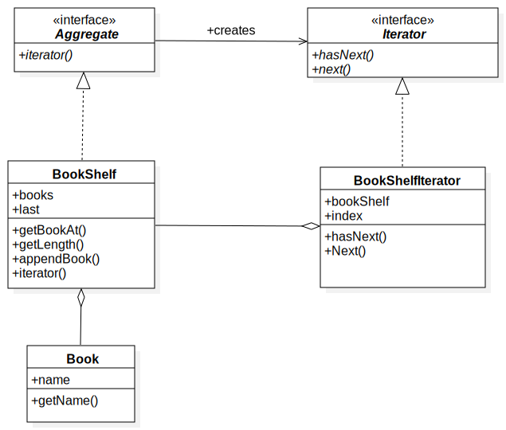

# Chapter0: Iterator模式
<div id="Iterator"></div>
## 1.类图

## 2.代码实现
+ Aggregate
```java
public interface Aggregate {
    public Iterator iterator();
}
```
+ BookShelf
```java
public class BookShelf implements Aggregate{
    private Book[] books;
    private Integer last=0;

    public BookShelf(Integer maxSize) {
        this.books = new Book[maxSize];
    }

    public Book getBookAt(Integer index){
        return books[index];
    }

    public void appendBook(Book book){
        this.books[last]=book;
        last++;
    }

    public Integer getLength(){
        return last;
    }

    @Override
    public Iterator iterator() {
        return new BookshelfIterator(this);
    }

}
```
+ Book
```java
public class Book {
    private String name;

    public Book(String name) {
        this.name = name;
    }

    public String getName() {
        return name;
    }

    public void setName(String name) {
        this.name = name;
    }
}
```
+ Iterator
```java
public interface Iterator {
    public boolean hasNext();
    public Object next();
}
```
+ BookShelfIterator
```java
public class BookshelfIterator implements Iterator {
    private BookShelf bookShelf;
    private Integer index=0;

    public BookshelfIterator(BookShelf bookShelf) {
        this.bookShelf = bookShelf;
    }

    @Override
    public boolean hasNext() {
        if(index>=bookShelf.getLength()){
            return false;
        }
        return true;
    }

    @Override
    public Object next() {
        Book ret=null;
        ret=bookShelf.getBookAt(index);
        index++;
        return ret;
    }
}
```

+ Main
```java
public class Main {
    //iterator遍历
    
    public static void main(String[] args){  
        BookShelf bookshelf=new BookShelf(10);
        bookshelf.appendBook(new Book("围城"));
        bookshelf.appendBook(new Book("月亮与六便士"));
        bookshelf.appendBook(new Book("三国演义"));
        bookshelf.appendBook(new Book("末日巨塔"));
        Iterator iterator=bookshelf.iterator();
        while(iterator.hasNext()){
            Book book=(Book) iterator.next();//注意向上转型
            System.out.println(book.getName());
        }
    }
}
```