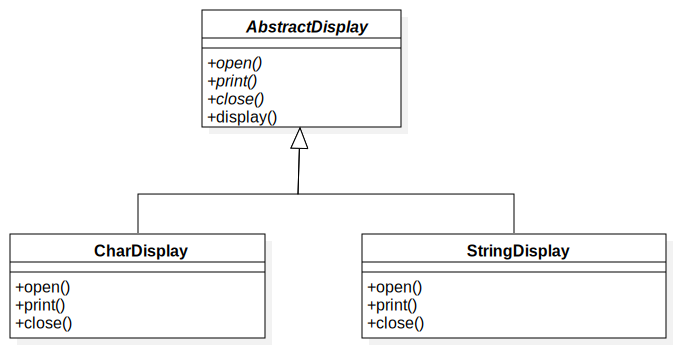

## Chapter2: Template Method模式

**父类定义处理流程，子类实现具体处理的模式。**

## 1.[类图](./uml_model/TemplateMethod.mdj)

## 2.代码实现
+ [抽象父类(AbstractDisplay)](./src/cn/edu/seu/wh/template/AbstractDisplay.java)

定义处理流程

+ [具体类(CharDisplay)](./src/cn/edu/seu/wh/template/CharDisplay.java)
+ [具体类(StringDisplay)](./src/cn/edu/seu/wh/template/StringDisplay.java)

实现具体处理细节

+ [Main类(Main)](./src/cn/edu/seu/wh/template/Main.java)

### 为什么是抽象类而不用接口？
这是因为TemplateMethod模式中的AbstractClass角色必须实现处理的流程。**抽象类可以实现一部分方法，而接口无法实现方法**。因此，在TemplateMethod模式中，无法用接口替代抽象类。