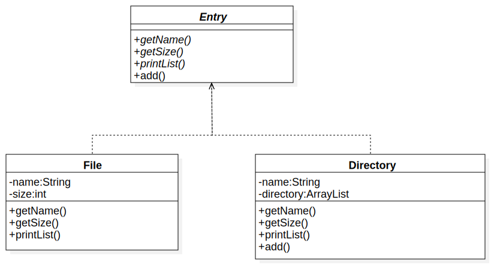

# Chapter10: Composite模式(容器与内容的一致性)
类似于电脑文件管理中的文件夹与文件，可以能够使**容器与内容具有一致性**，创造出递归结构的Composit模式。

## 1.[类图](../uml_model/composite.mdj)

## 2.代码实现
+ Leaf(树叶)：表示内容的角色，该类不能添加其他对象。File：[File子类](../src/cn/edu/seu/wh/composite/File.java)

+ Composite(复合物)：表示容器的角色，可以放入Leaf和Composite角色对象。Directory：[Directory子类](../src/cn/edu/seu/wh/composite/Directory.java)

+ Component：使内容与容器具有一致性。是Leaf和Composite的父类。 Entry：[Entry父类](../src/cn/edu/seu/wh/composite/Entry.java)

+ [Main传送门](../src/cn/edu/seu/wh/composite/Main.java)