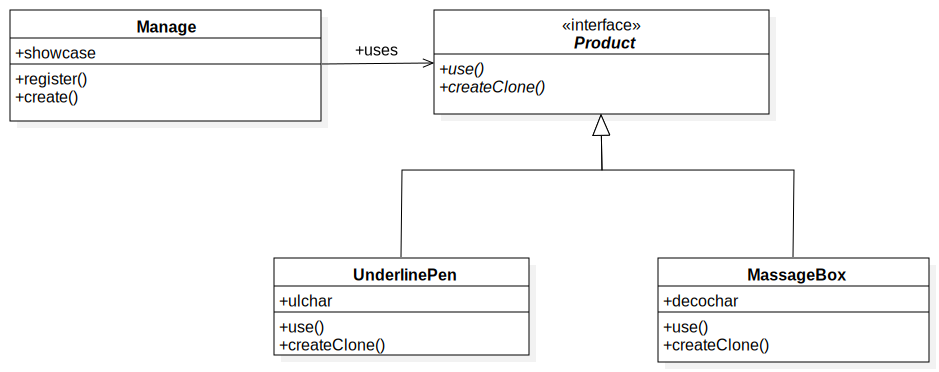

# Chapter5: Prototype 模式
应用场景：满足“**在不指定类名的前提下生成实例**”的需求。例如：

+ 对象种类繁多，无法将它们整合到一个类中

+ 难以根据类生成实例

+ 想解耦框架与生成的实例时

## 1.[类图](../uml_model/prototype.mdj)

## 2.代码实现
+ [Prototype(原型):Product类](../src/cn/edu/seu/wh/prototype/framework/Product.java)

负责**定义**用于复制现有实例来生成新实例的**方法**。

+ [ConcretePrototype(具体的原型):UnderlinePen和MassageBox类](../src/cn/edu/seu/wh/prototype/implinstance)

负责**实现**用于复制现有实例来生成新实例的**方法**

+ [Client(使用者):Manage类](../src/cn/edu/seu/wh/prototype/framework/Manage.java)

负责使用复制实例的方法生成新的实例。

## 问答：
### 1. 如何复用示例程序中的createClone方法？

两种继承方式

+ 将Product定义成一个类，实现createClone方法，然后继承Product类

+ 定义一个ConcreteProduct类去实现Product接口，然后继承ConcreteProduct类

### 2.在java.lang.Object中定义了clone方法，那么请问java.lang.Object类实现了java.lang.Clonable接口吗？

java.lang.Object没有实现Clonable接口，如果实现了则所有类即使没有实现该接口调用clone方法也不会抛出异常。**clone()是浅复制，如果要深复制需要重写clone()方法，重写后需要调用浅复制的clone()，可以super.clone()**

