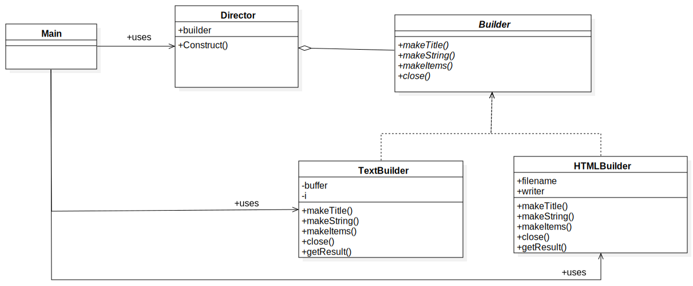

# Chapter6: Builder模式（组装复杂的实例）
## 1.[类图](../uml_model/builder.mdj)

## 2.代码实现
+ [Builder(建造者):Builder类](../src/cn/edu/seu/wh/builder/Builder.java)

负责定义用于生成实例的接口(API)

+ ConcreteBuilder(具体的建造者):[TextBuilder](../src/cn/edu/seu/wh/builder/TextBuilder.java) or [HTMLBuilder](../src/cn/edu/seu/wh/builder/HTMLBuilder.java)类

+ [Director(监工): Director类](../src/cn/edu/seu/wh/builder/Director.java)

负责使用Builder定义的实例API来生成实例。

+ [Client: Main类](../src/cn/edu/seu/wh/builder/Main.java)

## 心得体会：
时刻注意**可替换性**

Main类不知道调用了Builder，而实际是通过Director调用了Builder

Director类并不知道实际调用的是哪个具体的实例，而是通过*抽象类Builder*实现这样具体实例的**可替换性**

还有就是如何设计**接口**是要时刻关注的，这能决定一个类的对象能够控制什么。

## 思考：
### 1.String和StringBuffer、StringBuilder区别：
**String 字符串常量**

**StringBuffer 字符串变量（线程安全）**

**StringBuilder 字符串变量（非线程安全）**

简要的说，String类型和StringBuffer类型的主要性能区别其实在于String是不可变的对象，因此在**每次对String类型进行改变的时候其实都等同于生成了一个新的String对象**，然后将指针指向新的String对象，所以经常改变内容的字符串最好不要用String，因为每次生成对象都会对系统性能产生影响，**特别当内存中无引用对象多了以后，JVM的GC就会开始工作，那速度是一定会相当慢的**。

而如果是使用StringBuffer类则结果就不一样了，每次结果都会对StringBuffer对象本身进行操作，而不是生成新的对象，再改变对象引用。所以在一般情况下我们推荐使用StringBuffer，特别是字符串对象经常改变的情况下。而在某些特别情况下，String对象的字符串拼接其实是被JVM解释成了StringBuffer对象的拼接，所以这些时候String对象的速度并不会比StringBuffer对象慢，而特别是以下的字符串对象生成中，String效率是远要比StringBuffer快的：
```java
 String S1 = “This is only a” + “ simple” + “ test”;
 StringBuffer Sb = new StringBuilder(“This is only a”).append(“ simple”).append(“ test”);
 ```
你会很惊讶的发现，生成String S1对象的速度简直太快了，而这个时候StringBuffer居然速度上根本一点都不占优势。其实这是JVM的一个把戏，在JVM眼里，这个
 ```java
 String S1 = “This is only a” + “ simple” + “test”; 
 ```
 其实就是：
 ```java
 String S1 = “This is only a simple test”; 
 ```
所以当然不需要太多的时间了。但大家这里要注意的是，如果你的字符串是来自另外的String对象的话，速度就没那么快了，譬如：
```java
String S2 = “This is only a”;
String S3 = “ simple”;
String S4 = “ test”;
String S1 = S2 +S3 + S4;
```
这时候JVM会规规矩矩的按照原来的方式去做

**在大部分情况下 StringBuffer > String**

StringBuffer

Java.lang.StringBuffer线程安全的可变字符序列。一个类似于String的字符串缓冲区，但不能修改。虽然在任意时间点上它都包含某种特定的字符序列，但通过某些方法调用可以改变该序列的长度和内容。

可将字符串缓冲区安全地用于多个线程。可以在必要时对这些方法进行同步，因此任意特定实例上的所有操作就好像是以串行顺序发生的，该顺序与所涉及的每个线程进行的方法调用顺序一致。

StringBuffer上的主要操作是append和 insert方法，可重载这些方法，以接受任意类型的数据。每个方法都能有效地将给定的数据转换成字符串，然后将该字符串的字符追加或插入到字符串缓冲区中。append方法始终将这些字符添加到缓冲区的末端；而insert方法则在指定的点添加字符。

例如，如果z引用一个当前内容是“start”的字符串缓冲区对象，则此方法调用z.append("le")会使字符串缓冲区包含“startle”，而z.insert(4, "le")将更改字符串缓冲区，使之包含“starlet”。

**在大部分情况下 StringBuilder > StringBuffer**

java.lang.StringBuilder

java.lang.StringBuilder一个可变的字符序列是5.0新增的。此类提供一个与 StringBuffer 兼容的 API，但不保证同步。该类被设计用作 StringBuffer 的一个简易替换，用在字符串缓冲区被单个线程使用的时候（这种情况很普遍）。如果可能，建议优先采用该类，因为在大多数实现中，它比 StringBuffer 要快。两者的方法基本相同。