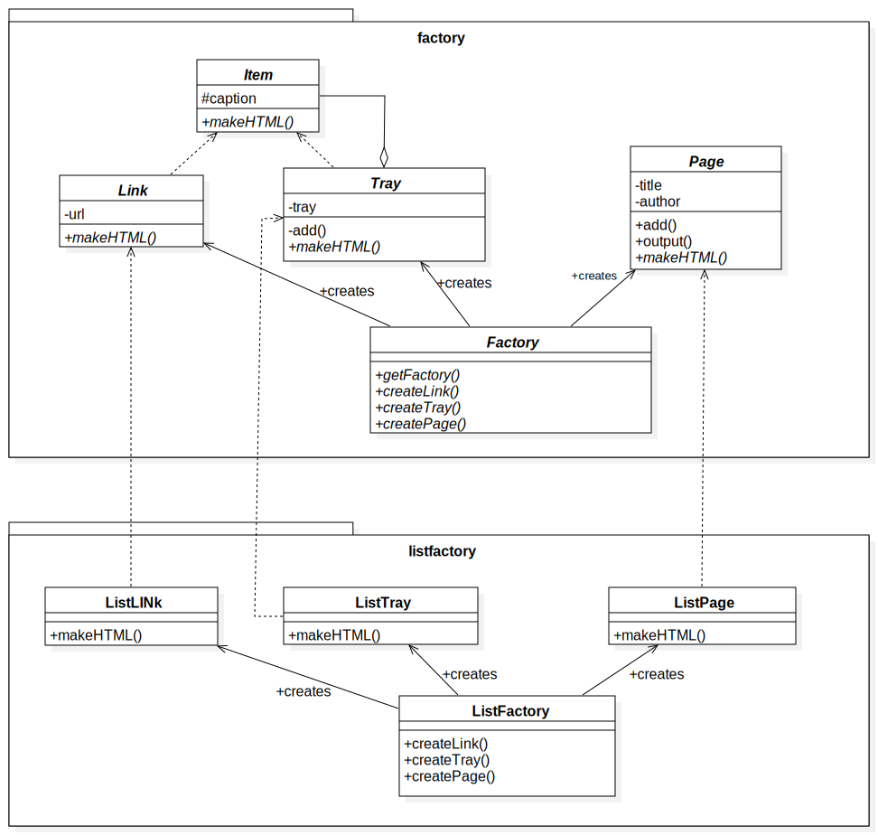

# Chapter7: Abstract Factory模式（将关联组件组装成产品）

“忘记方法的具体实现，使用抽象方法进行编程”的设计思想：Template Method、Builder等模式。

在Abstract Factory模式中将会出现抽象工厂，它会将抽象零件组装成抽象产品。也就是说**我们不关心零件的具体实现，而是只关心接口(API)。我们仅使用该接口(API)将零件组装成为产品。**

个人理解：Abstract Factory模式就是将工厂和零件都进行抽象成接口，具体实现可能不同，不同实现都有对应的具体工厂，工厂的作用是组装各零件成为一个产品。

该模式优点：易于增加具体的工厂

该模式缺点：难以增加新的零件 

## 1.[类图](../uml_model/abstractFactory.mdj)


## 2.代码实现
+ AbstractProduct(抽象产品)：[Link类](../src/cn/edu/seu/wh/abstractfactory/factory/Link.java)、[Tray类](../src/cn/edu/seu/wh/abstractfactory/factory/Tray.java)、[Page类](../src/cn/edu/seu/wh/abstractfactory/factory/Page.java)

AbtractProduct负责定义AbstractFactory所生成的抽象零件和产品的接口。

+ AbstractFactory(抽象工厂)：[Factory类](../src/cn/edu/seu/wh/abstractfactory/factory/Factory.java)

AbstractFactory负责定义用于生成抽象产品的接口。

+ Client(委托者):[Main类](../src/cn/edu/seu/wh/abstractfactory/Main.java)

调用AbstractFactory和AbstractProduct实现相关业务逻辑。对于具体的产品和工厂一无所知。

+ ConcreteProduct(具体产品):[ListLink类](../src/cn/edu/seu/wh/abstractfactory/listfactory/ListLink.java)、[ListTray类](../src/cn/edu/seu/wh/abstractfactory/listfactory/ListTray.java)、[ListPage类](../src/cn/edu/seu/wh/abstractfactory/listfactory/ListPage.java)

+ ConcreteFactory(具体工厂)：[ListFactory类](../src/cn/edu/seu/wh/abstractfactory/listfactory/ListFactory.java)


## 各种生成实例的方法介绍
### 1.new
```java
Something obj=new Something();
```
此时，类名会出现在代码中，也就是说此处代码与Something类强耦合了。

### 2.clone
在[Prototype模式](../content/6.builder.md)中学习过clone方法，根据现有的实例复制出一个新的实例。

```java
class Something{
  ...
  public Something createClone(){
    Something obj=null;
    try{
      obj=(Something)clone();
    }catch(CloneNotSupportedException e){
      e.printStachTrace();
    }
    return obj;
  }
}
```

### 3.newInstance
java.lang.Class类的newInstance方法可以通过Class类的实例生成出Class类所表示的类Something的实例（调用无参构造函数）.
```java
public static Factory getFactory(String classname){
        Factory factory=null;
        try{
            factory=(Factory)Class.forName(classname).newInstance();
        }catch (ClassNotFoundException e){
            System.out.println("没有找到 "+classname+" 类！");
        }catch (Exception e){
            e.printStackTrace();
        }
        return factory;
    }
```

## 问题
### 1.Tray类中的tray字段是protected，子类可以访问。如果将其改成private，会有哪些优缺点？

可见性设置为private的优点是Tray的子类（具体的零件）不会依赖于tray字段的实现。

可见性设置为private的缺点是必须重新编写一些方法，让外部可以访问自身。

通常，可见性设置为private，然后编写用于访问字段的方法会更安全。

### 2.ListLink类的构造函数如下：
```java
public ListLink(String caption, String url) {
        super(caption, url);
    }
```
也就是说，它只是调用了父类的构造函数。如果不需要其他处理，为什么还要特意定义ListLink类的构造函数呢？

这是因为**Java中无法继承构造函数。**

### 3.Page类的处理和Tray类处理相似，为什么没有让Page类继承Tray类呢？

如果继承了，则Page类也是Item类的子类，则Tray类可以添加Page类，这不符合HTML规范。