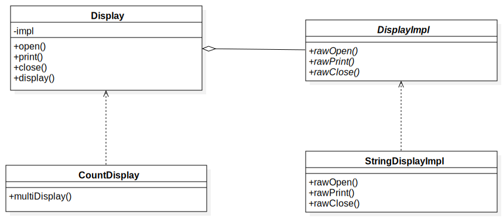

# Chapter8: Bridge模式

**将类的功能层次结构与实现层次结构分离**

## 1.[类图](../uml_model/abridge.mdj)

## 2.代码实现
+ Abstracttion(抽象化)：[Display类](../src/cn/edu/seu/wh/bridge/Display.java)

位于类的功能层次结构最上层.

+ RefinedAbstracttion(改善后的抽象化)：[CountDisplay类](../src/cn/edu/seu/wh/bridge/CountDisplay.java)

类的功能层次结构后续继承功能拓展。

+ Implementor(实现者)：[DisplayImpl类](../src/cn/edu/seu/wh/bridge/DisplayImpl.java)

位于类的实现层次结构最上层。

+ ConcreteImplementor(具体的实现者)：[StringDisplayImpl类](../src/cn/edu/seu/wh/bridge/StringDisplayImpl.java)

实现Implementor定义的接口。

+ Client：[Main类](../src/cn/edu/seu/wh/bridge/Main.java)

## 拓展：继承是强关联，委托是弱关联
